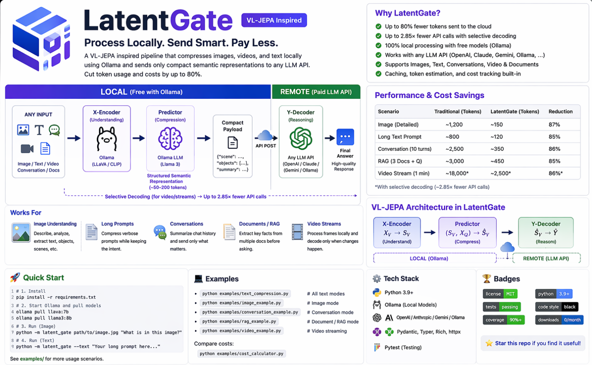

<div align="center">

# 🔮 LatentGate

### *Process Locally. Send Smart. Pay Less.*

**A VL-JEPA-inspired pipeline that compresses images, text, conversations, and RAG documents locally via Ollama, then sends only compact semantic payloads to any LLM API — cutting token costs by ~80%.**

[](https://www.python.org/downloads/)
[](LICENSE)
[](CHANGELOG.md)
[](CONTRIBUTING.md)
[](https://ollama.com)
[](https://modelcontextprotocol.io)

[**Quick Start**](#-quick-start) · [**AI Tool Integrations**](#-use-with-ai-coding-tools-mcp-integration) · [**Benchmarks**](#-cost-benchmarks) · [**Contributing**](#-contributing)

</div>

---

## 🏗️ Architecture

<div align="center">



</div>

---

## 💡 The Problem

Every time you send an image or long prompt to GPT-4o / Claude / Gemini, you are burning 1,000+ tokens on processing that could happen locally for free.

```
Traditional:  Image → Cloud LLM (1,200 tokens) → Answer
LatentGate:   Image → Local Ollama (FREE) → Cloud LLM (200 tokens) → Answer
```

---

## ✨ Features

- 🏠 **Local-First** — Vision and text compression runs on Ollama (free)
- 💰 **~80% Token Savings** — Send ~200 tokens instead of ~1,200
- 🔌 **MCP Server** — Works with Claude Desktop, Cursor, Cline, Continue, Zed
- 🎯 **Selective Decoding** — For video, only call API when scene changes (~2.85x fewer calls) with cosine similarity
- 📝 **Text Compression** — Long prompts, conversations, RAG docs compressed locally
- ⚡ **Speed Optimized** — Connection pooling, model preloading, parallel processing
- 🔌 **Multi-Provider** — OpenAI, Anthropic, Google, Groq, or any OpenAI-compatible endpoint
- 🌐 **REST API** — FastAPI server for web application integration
- 📹 **Video Processing** — Direct video file input with automatic frame extraction
- 📊 **Cost Tracking** — Persistent cost tracking with analytics and exportable reports
- ⏱️ **Async Support** — Non-blocking async methods for modern Python applications
- 🔄 **Streaming Responses** — Stream responses from remote LLMs
- 📝 **Config Persistence** — YAML/TOML config files with environment variable overrides
- 📋 **Structured Logging** — JSON-formatted logging with rotation and correlation IDs
- 🐳 **Docker Support** — Dockerfile and docker-compose for easy deployment
- 🔌 **Plugin System** — Custom processors for domain-specific compression
- 🌍 **Multi-Language** — Support for 30+ languages with automatic detection

---

## 🚀 Quick Start

### Install

```bash
# Core install
pip install latent-gate

# With MCP server (for Claude Desktop, Cursor, Cline, etc.)
pip install latent-gate[mcp]

# With API server (for web applications)
pip install latent-gate[api]

# With all features
pip install latent-gate[all]

# Pull required Ollama models
ollama pull llava:7b
ollama pull llama3:8b
```

### Run

```bash
# Image query
python -m latent_gate photo.jpg "What is in this image?" --provider ollama -v

# Text compression
python -m latent_gate --text "Your long prompt here..." --provider ollama -v

# Image + Text combined
python -m latent_gate photo.jpg "Analyze" --text "Extra context..." -v

# Start API server
latent-gate-api
```

### Python API

```python
from latent_gate import LatentGatePipeline, PipelineConfig

config = PipelineConfig(
    vision_model="llava:7b",
    remote_provider="openai",
    remote_model="gpt-4o-mini",
)

with LatentGatePipeline(config) as pipeline:
    result = pipeline.query("photo.jpg", "Describe this")
    result = pipeline.query_text("Your 500-word prompt...")
    result = pipeline.query_conversation(messages, "Follow-up question")
    result = pipeline.query_documents(["doc1...", "doc2..."], "Question?")
    result = pipeline.query_universal(text="...", image="photo.jpg")

    print(result["timing"])
    print(result["tokens_estimated"])
```

### REST API

```bash
# Start the API server
latent-gate-api

# Or with custom host/port
LATENTGATE_HOST=127.0.0.1 LATENTGATE_PORT=9000 latent-gate-api
```

```python
import requests

# Image query
response = requests.post("http://localhost:8000/query/image", json={
    "image_path": "photo.jpg",
    "question": "What is in this image?"
})

# Text query
response = requests.post("http://localhost:8000/query/text", json={
    "text": "Your long prompt here...",
    "question": "Summarize this"
})

# Health check
response = requests.get("http://localhost:8000/health")
```

### Video Processing

```python
from latent_gate import VideoProcessor, VideoConfig

video_config = VideoConfig(fps=1.0, max_frames=50)

with VideoProcessor(config, video_config) as processor:
    result = processor.process_video("video.mp4", "Describe the action")
    print(result["statistics"])
```

### Async Support

```python
import asyncio
from latent_gate import AsyncLatentGatePipeline, PipelineConfig

async def main():
    async with AsyncLatentGatePipeline() as pipeline:
        result = await pipeline.query("photo.jpg", "What is this?")
        
        # Process multiple images concurrently
        results = await pipeline.query_many_images(
            ["img1.jpg", "img2.jpg", "img3.jpg"],
            "Describe each image"
        )

asyncio.run(main())
```

### Configuration File

```yaml
# latentgate.yaml
vision_model: llava:7b
predictor_model: llama3:8b
remote_provider: openai
remote_model: gpt-4o-mini
selective_decoding: true
similarity_threshold: 0.85
use_embeddings: true
```

```python
from latent_gate import get_config, LatentGatePipeline

config = get_config("latentgate.yaml")
with LatentGatePipeline(config) as pipeline:
    result = pipeline.query("photo.jpg", "Describe this")
```

### Docker

```bash
# Start with Docker Compose
docker-compose up -d

# Or build and run manually
docker build -t latent-gate .
docker run -p 8000:8000 latent-gate
```

### Multi-Language Support

```python
from latent_gate import detect_language, MultiLanguageProcessor

# Detect language
lang = detect_language("Esto es un texto en español")
print(f"Detected: {lang.name} ({lang.confidence:.0%})")

# Process with auto-translation
processor = MultiLanguageProcessor()
text, lang_info = processor.process("Texto en español para analizar")
```

### Cost Tracking

```python
from latent_gate import CostTracker

tracker = CostTracker()
tracker.record_usage(
    query_type="image",
    provider="openai",
    model="gpt-4o-mini",
    input_tokens=150,
    output_tokens=200,
    tokens_saved=1000,
    compression_ratio=6.7,
    latency_ms=1500,
)

stats = tracker.get_statistics()
print(f"Total cost: ${stats['total_cost']:.4f}")

# Get cost projection
projection = tracker.get_cost_projection(
    daily_queries=1000,
    provider="openai",
    model="gpt-4o-mini"
)
print(f"Monthly savings: ${projection['savings']['monthly']:.2f}")
```

---

## 🔌 Use With AI Coding Tools (MCP Integration)

LatentGate works as a Model Context Protocol (MCP) server with every major AI coding tool. Once configured, your AI assistant automatically compresses images, long prompts, and documents — saving you ~80% on tokens without changing your workflow.

### Supported Tools

| Tool              | Status      | Extension |
| ----------------- | ----------- | --------- |
| VSCode / Copilot  | Supported   | [Marketplace](https://marketplace.visualstudio.com/items?itemName=KathanModh.latent-gate) |
| Claude Desktop    | Supported   | MCP Config |
| Claude Code (CLI) | Supported   | Skill |
| Cursor            | Supported   | MCP Config |
| Cline (VS Code)   | Supported   | MCP Config |
| Continue.dev      | Supported   | MCP Config |
| Zed Editor        | Supported   | MCP Config |

### VSCode Extension

Install from the VSCode Marketplace:

```bash
code --install-extension KathanModh.latent-gate
```

Or search "LatentGate" in VSCode Extensions panel.

**Features:**
- Right-click any image → Compress with LatentGate
- Select text → `Ctrl+Shift+Alt+C` to compress
- Cost dashboard in activity bar
- Auto-configures MCP for Copilot Chat
- Status bar showing token savings

### Quick Setup

```bash
pip install latent-gate[mcp]
ollama pull llava:7b
ollama pull llama3:8b
```

Then add to your AI tool MCP config:

```json
{
  "mcpServers": {
    "latent-gate": {
      "command": "python",
      "args": ["-m", "latent_gate.mcp_server"]
    }
  }
}
```

Detailed setup guides for each tool: see the `integrations/` folder.

### What Gets Compressed Automatically

| Tool Call               | When AI Uses It                |
| ----------------------- | ------------------------------ |
| `compress_image`        | Before analyzing any image     |
| `compress_text`         | For prompts longer than ~500 tokens |
| `compress_conversation` | When chat history is large     |
| `compress_documents`    | For RAG queries                |
| `get_stats`             | To check session savings       |

---

## ⚡ Speed Optimizations

| Optimization          | What It Does                                                | Impact                          |
| --------------------- | ----------------------------------------------------------- | ------------------------------- |
| Connection Pooling    | Reuses HTTP connections via `requests.Session`              | ~30-50% faster per call         |
| Model Preloading      | Warms up Ollama models on init (`keep_alive`)               | Eliminates 5-15s cold start     |
| Shorter Prompts       | Optimized extraction prompts produce fewer output tokens    | ~20% faster generation          |
| 3-Tier JSON Parsing   | Fast parse, extract from text, LLM fallback                 | Avoids slow LLM call 90% of time |
| Parallel Processing   | Image and text processed simultaneously via ThreadPool      | ~40% faster combined queries    |
| Caching               | Content-hash disk cache for repeated images                 | Instant on cache hit            |

---

## 📊 Cost Benchmarks

### Image Queries (by provider)

| Provider                       | Raw Image Tokens | LatentGate Tokens | Savings |
| ------------------------------ | ---------------: | ----------------: | ------- |
| OpenAI GPT-4o (high detail)    | ~1,105           | ~150              | ~86%    |
| Claude 3.5 Sonnet (1MP image)  | ~1,334           | ~150              | ~89%    |
| Gemini 3 Pro                   | ~560             | ~150              | ~73%    |
| Gemini 2.0 Flash               | ~258             | ~150              | ~42%    |

### Text and Other Modes (all providers benefit equally)

| Scenario                  | Traditional | LatentGate           | Savings |
| ------------------------- | ----------: | -------------------: | ------- |
| Long text prompt          | ~800        | ~120                 | ~85%    |
| Conversation (10 turns)   | ~2,500      | ~350                 | ~86%    |
| RAG documents (3 docs)    | ~3,000      | ~450                 | ~85%    |
| Video stream (1 min)*     | varies      | ~2.85x fewer calls   | ~65%    |

*With selective decoding

### At Scale (10,000 image queries with gpt-4o-mini)

|                | Traditional | LatentGate | Savings        |
| -------------- | ----------- | ---------- | -------------- |
| Input tokens   | 12,000,000  | 2,000,000  | 10M tokens     |
| Cost           | $1.80       | $0.30      | $1.50 (83%)    |

---

## 📁 Project Structure

```
latent-gate/
├── latent_gate/
│   ├── __init__.py
│   ├── config.py
│   ├── payload.py
│   ├── text_processor.py
│   ├── local_processor.py
│   ├── remote_decoder.py
│   ├── selective_decoder.py
│   ├── fast_client.py
│   ├── cache.py
│   ├── pipeline.py
│   ├── async_pipeline.py
│   ├── cli.py
│   ├── mcp_server.py
│   ├── api_server.py
│   ├── video_processor.py
│   ├── cost_tracker.py
│   ├── config_loader.py
│   ├── logging_config.py
│   ├── plugin_system.py
│   └── multilang.py
├── integrations/
│   ├── README.md
│   ├── mcp_server/
│   ├── claude_code_skill/
│   ├── cursor/
│   ├── continue_dev/
│   └── openai_functions/
├── examples/
├── tests/
├── docs/
│   ├── architecture.png
│   └── how_it_works.md
├── .github/
│   └── workflows/
│       ├── ci.yml
│       └── publish.yml
├── Dockerfile
├── docker-compose.yml
├── docker-compose.dev.yml
├── .dockerignore
├── MANIFEST.in
├── publish.py
├── CHANGELOG.md
├── LICENSE
├── README.md
├── CONTRIBUTING.md
├── pyproject.toml
└── requirements.txt
```

---

## 🤝 Contributing

Contributions welcome! See [CONTRIBUTING.md](CONTRIBUTING.md).

### Priority Areas

- True embedding similarity (replace Jaccard with cosine via sentence-transformers)
- FastAPI server wrapper
- Direct video file input (auto frame extraction)
- Cost tracking dashboard
- More vision model support (Florence-2, InternVL)
- PyPI publish

---

## 📄 Citation

```bibtex
@software{latentgate2026,
  author  = {Kathan Modh},
  title   = {LatentGate: Local-First Vision-Language Pipeline Inspired by VL-JEPA},
  year    = {2026},
  version = {0.4.0},
  url     = {https://github.com/KathanModh259/latent-gate}
}
```

Inspired by [VL-JEPA](https://arxiv.org/abs/2512.10942) (Meta FAIR, 2025).

---

## 📜 License

MIT License — see [LICENSE](LICENSE).

---

<div align="center">

**Built with 🧠 by [Kathan Modh](https://github.com/KathanModh259)**

*Process locally. Send smart. Pay less.*

Star this repo if it saved you tokens (and money)!

</div>
